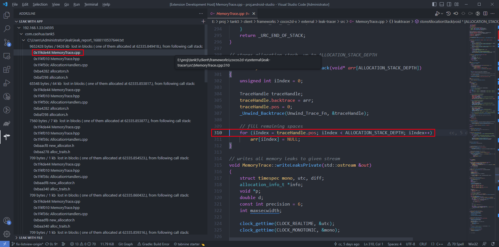
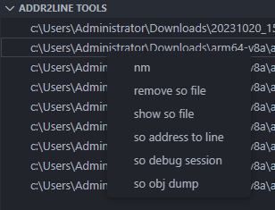

# leak with app
这个面板是分析leak-tracer的内存泄露日志，leak-tracer也有解析日志的脚本，但是并不是太好用。

> 目前仅支持windows
## 使用前的配置
- set leak file：
  
  设置内存泄露的日志文件，推荐`files/Download/leak_report.txt`，这个路径要和app日志的保存位置有关系。
- set executable file

  携带调试符号文件的路径，addr2line命令行需要这个参数

- set leak rank

  过滤内存泄露的结果，显示最大的结果。默认显示20个，建议不要设置过大！
## 使用步骤

1. 确保`adb`可以通过WiFi连接手机，这也是要配置ip的原因。
2. 添加设备ip。
3. 添加app的包名。
4. 通过adb从设备上拉取日志文件到本地。
5. 解析堆栈符号地址，只展示设置的排行数量。如果源码文件有效，点击可以跳转到源码，方便查阅。

效果如下：

# addr2line tools

这个面板是对so文件进行一些常规的分析

使用步骤：
1. 通过右上角的`+`按钮，添加so文件，对于`nm`, `objdump`的结果保存目录可以通过文件夹图标看到。
   
3. 右键列表中的so文件进行一些分析
  
  
- nm : 使用nm查看so文件的符号表等相关信息，如果so文件比较大，这个过程可能比较漫长 
- remove so file: 将当前so文件从列表中移除，并不会删除该so文件
- show so file: 在文件夹中显示so文件
- so address to line: 输入符号地址，通过addr2line转换为源码地址
- so debug session: 使用`readelf`获取so文件的信息，主要是为了观察so的各个section headers，用来判断so是否包含debug相关信息
- so objdump: 使用objdump得到so的反汇编，自动将结果保存到本地文件中，如果so文件比较大，这个过程可能比较漫长。

对于结果的数据量比较大的情况，耗时非常久，如果想结束这个过程，可以使用命令`killCurrentProcess`结束这个过程。